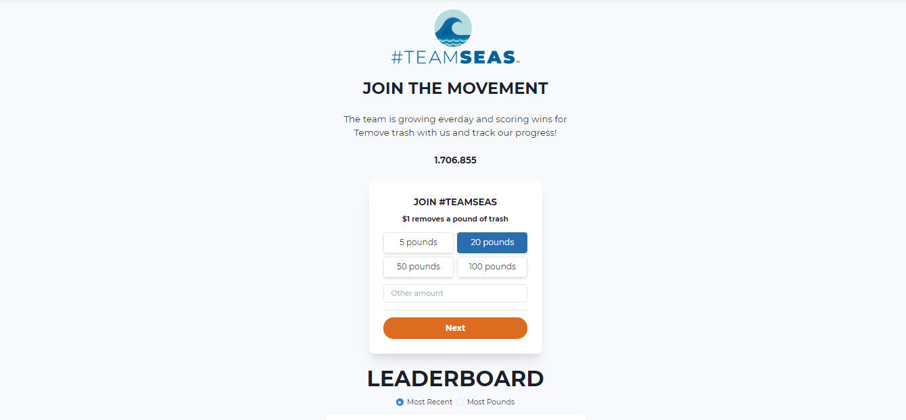

<div align="center">
  <p align="center">
    
  </p>
 <h1>Frontend Teamseas - Reactjs - Chackra-UI - Formik</h1>
</div>

## COMANDOS

Criando projeto em Reactjs utilizando template do chakra-ui
https://chakra-ui.com/docs/getting-started

```bash
    npx create-react-app teamseas-ui --template @chakra-ui/typescript
```

```bash
    npm install @fontsource/montserrat
```

```bash
    npm install urql graphql-ws
```

```bash
    npm install date-fns
```

```bash
npm install formik yup
```
